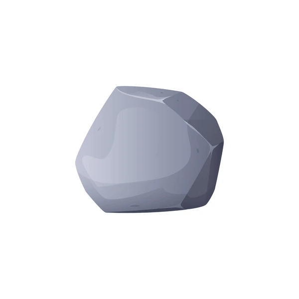

# The Idea

<UNTITLED> is a social app that gamifies staying physically active. It seeks to influence users to maintain consistent activity through peer pressure (social feed) and personal progression (levels and unlockables).

## Problem

Fitness is a social behaviour, even if the activity itself does not involved interaction with others. Having worked out for a decade, mostly alone, I still lose the will to go during periods of stress or having been away for long periods, especially when everyone else around me doesn't have fitness as a priority. 

Many people post their workouts on Instagram, Strava, Facebook, etc, but the good influence (exercise) gets lost in the bad influence (vacations, nice dinners, new cars, etc.). I would like to distill only the positive influences into peer pressure that can help me to prioritize fitness daily.

If anything, gym is such a boring exercise already, and people are afraid to talk about themselves, why not make it more social?

## Design Principles

### User content
   
Users may only post activity updates. Activity updates are not for long-winded posting and journaling, they only contain these details:

- Who: username and real name (optional) e.g. `@olivesarenice Oliver. Q just did an activity:`
- What: the activity label selected by the user, it may be a custom label or one of the many pre-configured activities in the app e.g. `RUN`
- When: timestamp e.g. `at 11:50AM 20 Dec 2024`
- Where: optional location tag with option to hide the actual location e.g. `Anytime Fitness (Buona Vista) [link to GMaps object]` OR simply `Anytime Fitness`
- Why: all activities should contribute to a user's consistency goal. The actual mechanics of how an activity adds to the user's level depends on the mechanics of the goal, explained later. e.g. `Run 3 times a week`
- How: additional details about the activity for the user's own logging and to share. e.g. time-based `30 mins` | output-based `5 km` | custom `<VALUE> <UNITS>`: `3 rounds` / `Upper Split`
- Proof: optional for users who want their activity verified. It will not be displayed on the card, but other users can click on a 🪪 icon to see the submitted proof.
  
Altogether:

```
11:50AM 20 Dec 2024
@olivesarenice Oliver. Q just did a 5km run at Anytime Fitness (Buona Vista)
+1 towards "Run 3 times a week"

14:24PM 19 Dec 2024
@olivesarenice Oliver. Q just did a Upper Split gym session at Anytime Fitness (Buona Vista)
+1 towards "Gym 2 times a week"
```

### Content Verification

By default, all activities are 'Unverified'. Activities that are verified will have a check mark next to it:✅

Verification can happen in these phases (not implemented yet):

1. A screenshot from verified sources such as wearables and other apps
2. Photo-based 

### Progression Mechanisms

This game has a single progression mechanism that is based on 2 attributes of a user:
- ENERGY⚡: Represents the current points that the user has in a given rank.  

    Energy is gained for each activity logged. Once an activity is logged for the day, the goal goes on cooldown. Subsequent activities for the goals in cooldown provide exponentially lower energy, to regulate against users logging trivial activities. Cooldowns reset at 2AM local time.
    
    The total number of energy points required depends on the number of goals set, and the completion criteria of each goal.

    For example a user with these goals:

    ```
    Gym 2 times a week
    Run 1 time a week
    BJJ 3 times a week
    ```

    Would require 6 points to have a full energy bar. The points are scaled out of 100% for easier comparison. Hence, each unique activity would reward ~15% energy.

- MOMENTUM🔥: A single value that represents the rank of the user.

   🔥 only increases when a user collects ALL energy points on ALL goals for the week (full energy bar). Once the user has completed ALL goals, the value of 🔥 increase depends on the number of goals the user has ongoing. So if the user completes all 2 goals, they gain +2 🔥. If they complete 1 out of 2 goals, they gain +0 🔥. This encourages focusing on less goals and more consistency.

   Higher 🔥 users can unlock:

        - more goal slots (default of 1), hence increasing their rate of 🔥 gain, if they are able to keep up with the pace. This is self-regulating since most people would not be able to keep up with more than 3 weekly goals at a time.


    If the week's goals are not completed, 🔥 can either fall or stay.

    🔥 stays if the user has energy >= 50% across all stated goals. The user also escapes the DANGER zone if they were in it previously.

    However, if the user has energy < 50% across all stated goals, 🔥 drops to a DANGER zone. If 🔥 is already in the DANGER zone, then momentum decreases by -1.

    If the user has completely 0% energy, 🔥 drops regardless of whether they are in a DANGER zone.

    These thresholds can be adjusted to be more lenient if needed.

    Basic Progression (equivalent to weeks of consistency):

    1 to 4: Up to 1 Goal
    5 to 8: Up to 2 Goals
    9 and above : Up to 3 Goals
   
   A user's max achieved 🔥 does not decay.

#### Goals

Goals define the personalisation of each user's progression. A user has a limited number of goal slots. 
Goals are specified as:

```
Activity: gym | bjj | climbing | powerlifting | tennis | pickleball | ...
Frequency: 2
Period: weekly | daily (daily goals have no frequency)
Start date: 24 Dec 2024
```

### Reward Mechanisms    

Rewards should promote user retention through competition and bragging.

#### Flairs

These are simlar to Reddit's flair system which appear beside your activity posts. Users unlock flairs each time surpass their max 🔥.
Flair unlocks are semi-random, where each range of 🔥 has a different set of flairs with different rarities.

#### Skins

All users come with a default profile picture - the Boulder mascot 🪨. 



This profile can be replaced with a user's chosen photo or a customised version (colour scheme and accessory) of their Boulder 🪨

Levelling up gives the user skin drops which they customise their Boulder.

## User Experience/ Flow

The platform is designed to be a simple web app, which later can be ported into Android or iOS apps.

### Signup

Users signup through the default email workflow (including SSO integrations)

After signup, they are redirected to setup their profile:

1. Info: Username, Display name, Privacy settings
2. Network: Select some users to follow
3. Goals: Create a goal from template 

### Navigation

The navigation bar is always visible at the bottom and moves the user to these pages:

0. Log activity pop-up
1. Home feed
2. Own profile
3. User search list
4. Settings


### Logging an activity

Form pops up and allows users to fill in the [user content](#user-content). Activities cannot be modified after they have been posted - otherwise, it would not be possible to recalculate the points.

### Home feed

Simple most recent activity feed from all followers. An activity post contains the same info as per [user content](#user-content) and also the user's profile picture or avatar, with their current enery bar progress and momentum level displayed. 

For now, users may interact with posts on their feed using likes, likes are anonymous. Although we may want to allow comments in future.

### Viewing profiles

The profile page should show the following information about a user:

**Info section**

1. Profile picture
2. Name
3. Flairs (if any)
4. Current status (energy and momentum)
5. Lifetime points collected
6. Max momentum achieved
7. No. of followers in common (but not the total number of followers), with the option to see all list

**Goals section**

1. Goal activity
2. Goal target frequency
3. Goal start date

**Activity Log**

1. Condensed log of the user's activities similar to home feed.

### Notifications

We can send users notification via the browser for these events:

1. Someone you follow just logged an activity
2. Someone you follow just levelled up